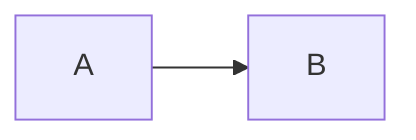

# H1 Title

Plain paragraph alpha.

Here is **boldspan** and more text.

Here is [linktext](https://example.com) end.

- [ ] taskitem unchecked
- [x] taskitem checked

$$
E = mc^2
$$

| ColA | ColB |
| :---: | ---: |
| a | **boldcell** |

```js
console.log(1)
```



[toc]


