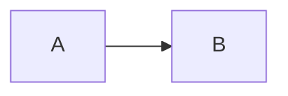

# Observe Head

Paragraph one.

**bold text** and `inline code`.

## Links
[example](https://example.com)

## Task
- [ ] open
- [x] done

## Code
```js
console.log(1)
```

## Math
$$
E = mc^2
$$

## Table
| A | B |
| --- | --- |
| 1 | **x** |

## Mermaid


## TOC
[toc]

## Image


## Broken

