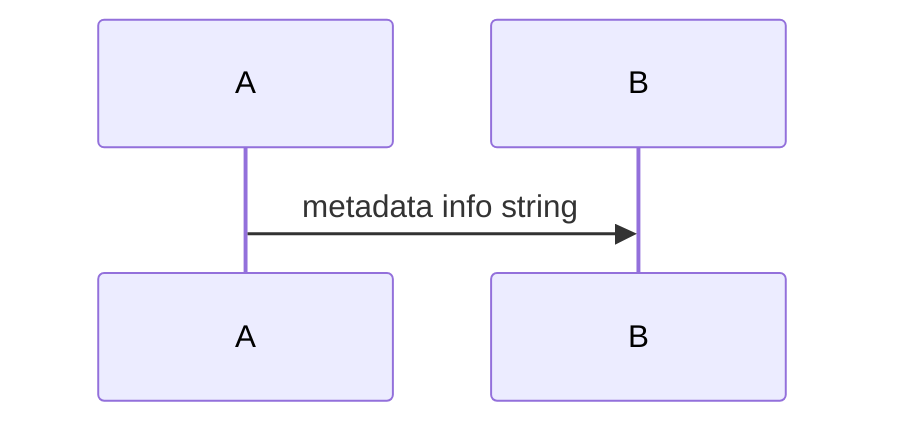
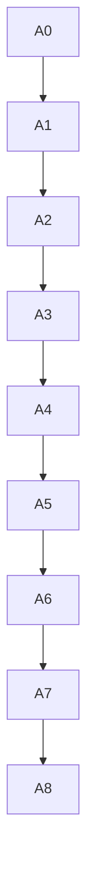
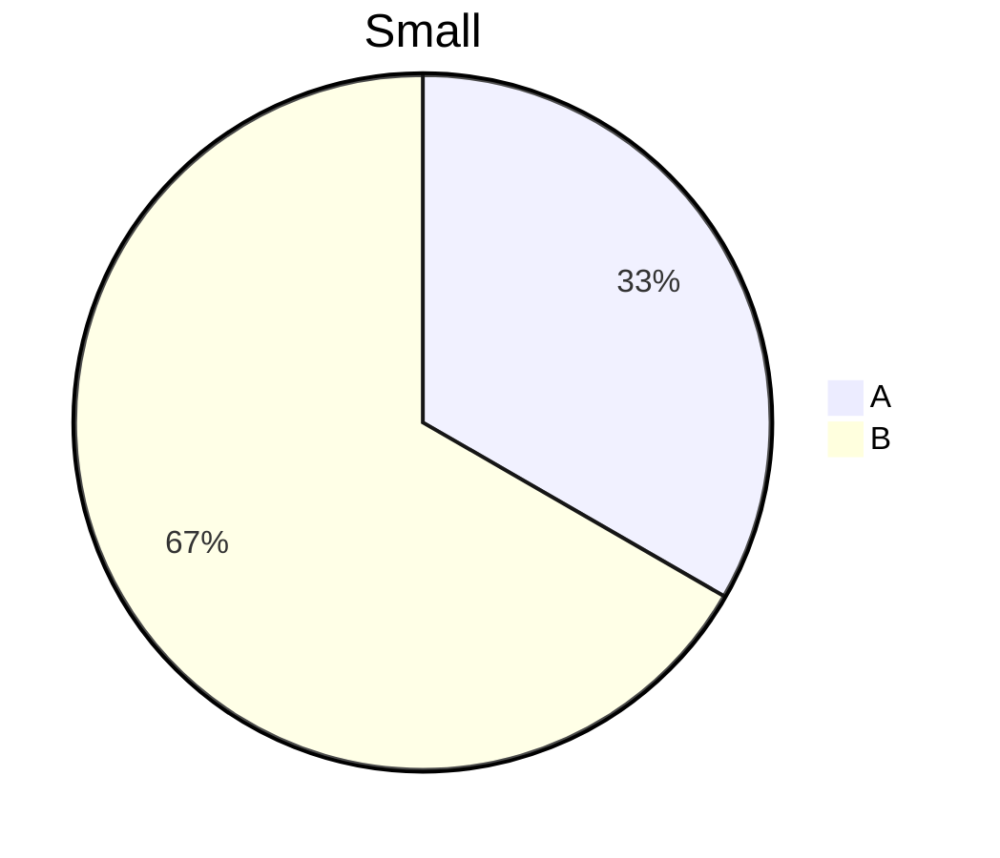
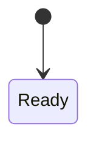
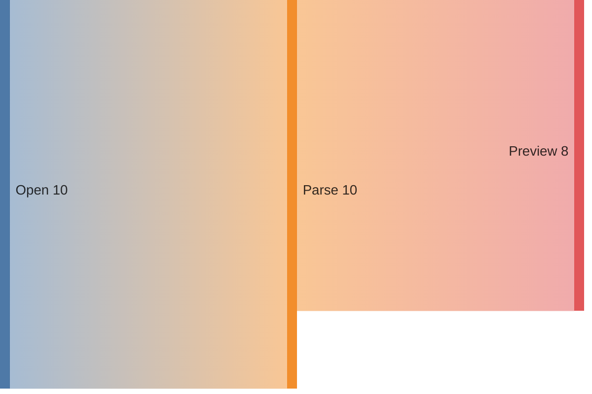
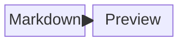

# Mermaid Edge Cases

Uppercase info string:

```MERMAID
flowchart LR
  A --> B
```

Metadata-like info string:



Invalid diagram that should show a localized error widget:

```mermaid
this is not valid mermaid
```

Long but simple graph:



Consecutive blocks:




Additional modern Mermaid diagrams:



```mermaid
xychart-beta
  title "Fixture Growth"
  x-axis [Jan, Feb, Mar]
  y-axis "Files" 0 --> 10
  line [3, 6, 9]
```



```mermaid
info
```


Text after edge cases.
