# Mermaid Gallery Fixture

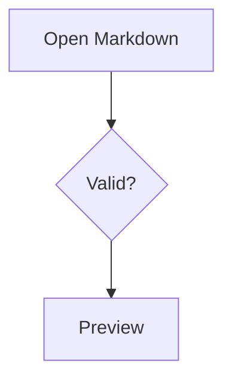
```mermaid
flowchart TD
  A[Open Markdown] --> B{Valid?}
  B --> C[Preview]
```

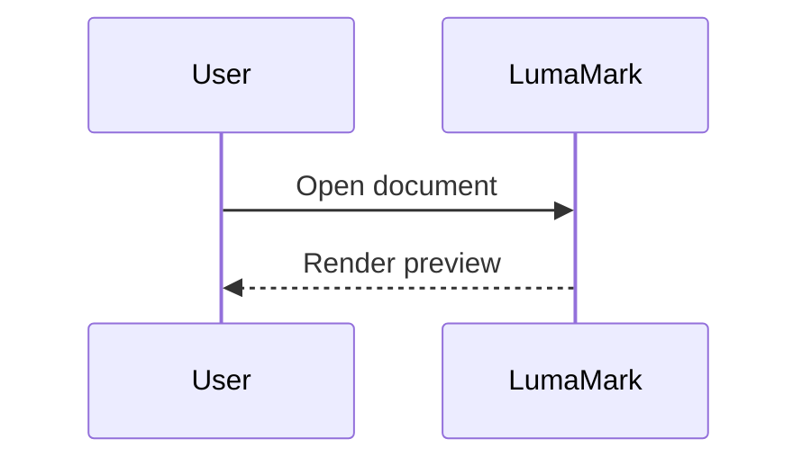
```mermaid
sequenceDiagram
  participant User
  participant LumaMark
  User->>LumaMark: Open document
  LumaMark-->>User: Render preview
```

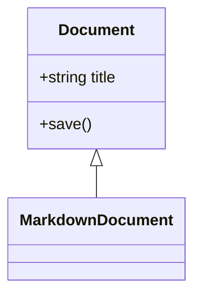
```mermaid
classDiagram
  class Document {
    +string title
    +save()
  }
  Document <|-- MarkdownDocument
```

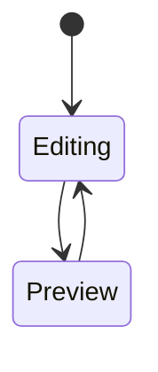
```mermaid
stateDiagram-v2
  [*] --> Editing
  Editing --> Preview
  Preview --> Editing
```

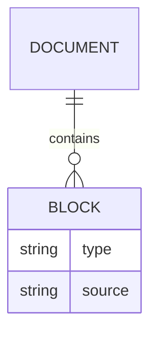
```mermaid
erDiagram
  DOCUMENT ||--o{ BLOCK : contains
  BLOCK {
    string type
    string source
  }
```

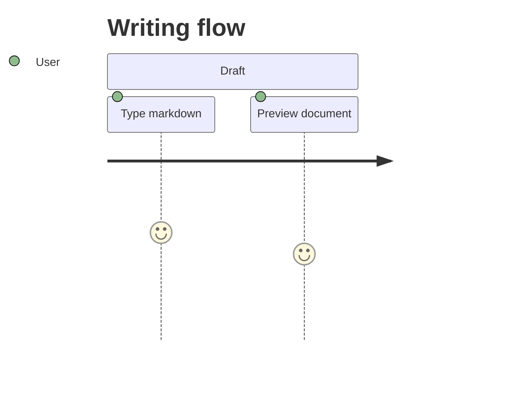
```mermaid
journey
  title Writing flow
  section Draft
    Type markdown: 5: User
    Preview document: 4: User
```

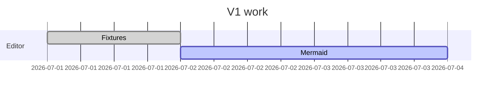
```mermaid
gantt
  title V1 work
  dateFormat  YYYY-MM-DD
  section Editor
  Fixtures :done, 2026-07-01, 1d
  Mermaid :active, 2026-07-02, 2d
```

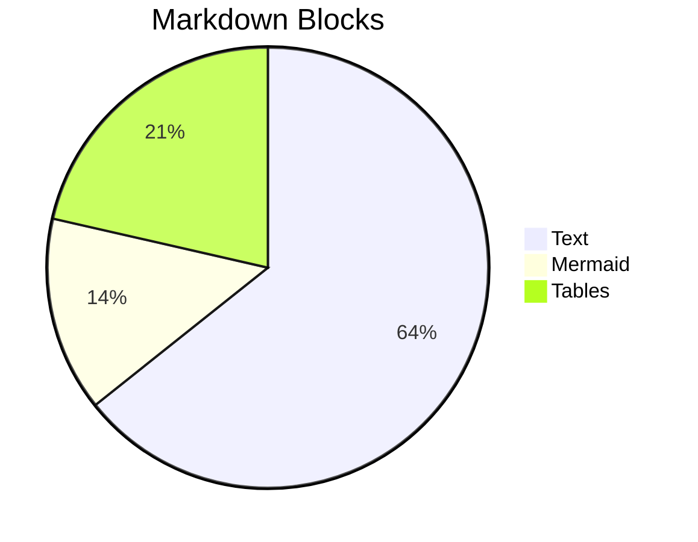
```mermaid
pie title Markdown Blocks
  "Text" : 45
  "Mermaid" : 10
  "Tables" : 15
```

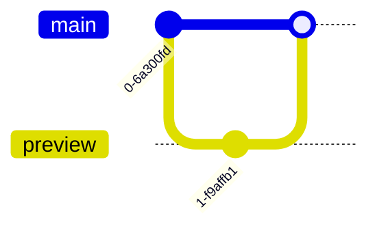
```mermaid
gitGraph
  commit
  branch preview
  checkout preview
  commit
  checkout main
  merge preview
```

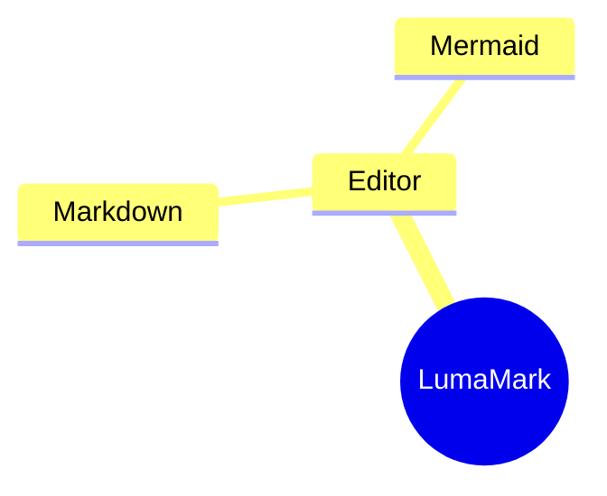
```mermaid
mindmap
  root((LumaMark))
    Editor
      Markdown
      Mermaid
```

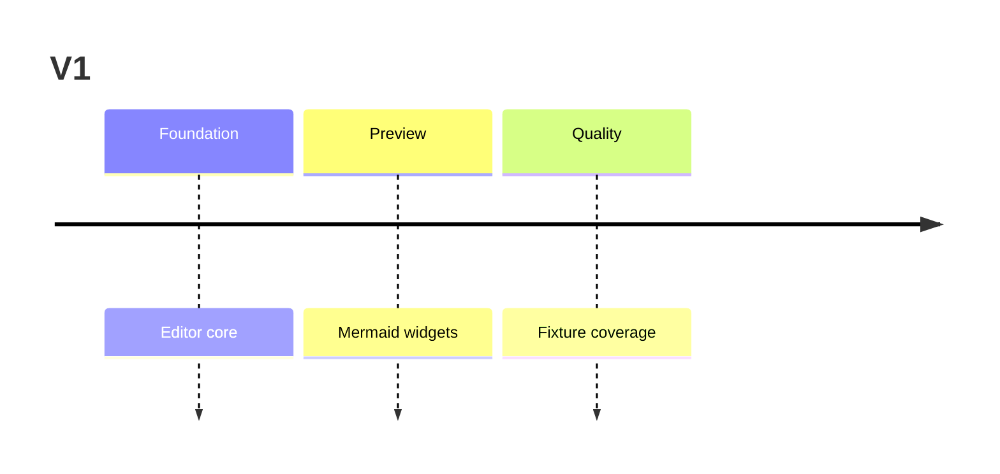
```mermaid
timeline
  title V1
  Foundation : Editor core
  Preview : Mermaid widgets
  Quality : Fixture coverage
```

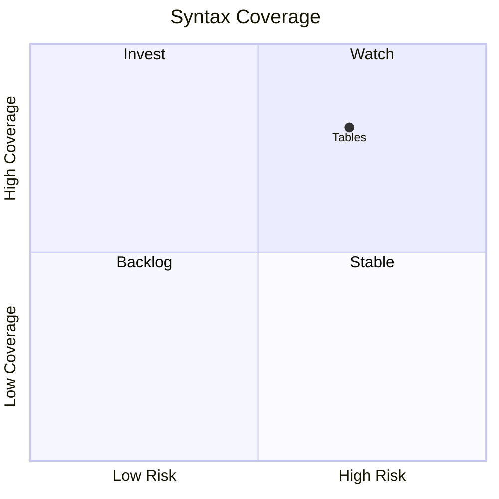
```mermaid
quadrantChart
  title Syntax Coverage
  x-axis Low Risk --> High Risk
  y-axis Low Coverage --> High Coverage
  quadrant-1 Watch
  quadrant-2 Invest
  quadrant-3 Backlog
  quadrant-4 Stable
  Tables: [0.70, 0.80]
```

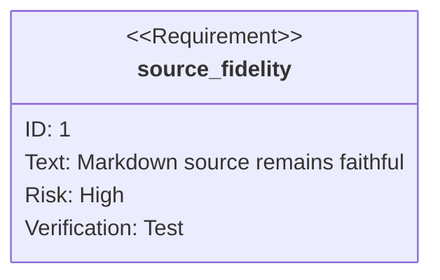
```mermaid
requirementDiagram
  requirement source_fidelity {
    id: 1
    text: Markdown source remains faithful
    risk: high
    verifymethod: test
  }
```

Gallery text after all diagrams.
