# Mermaid Gallery Fixture

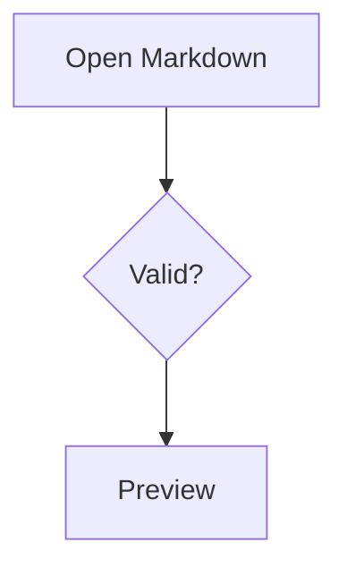

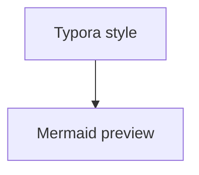

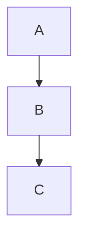

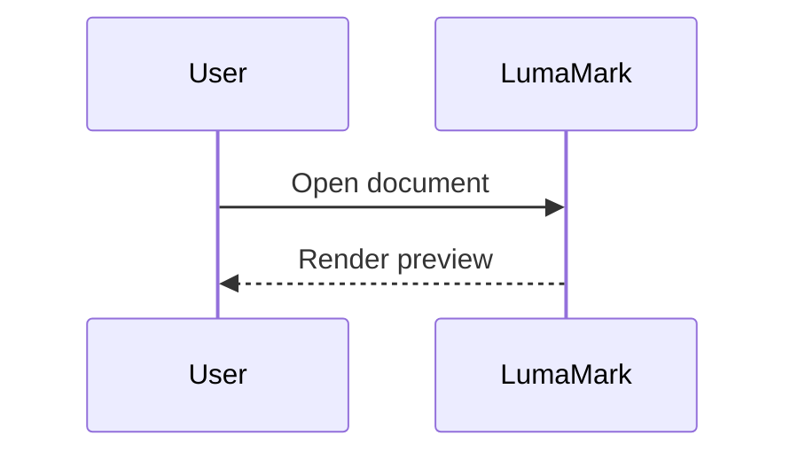

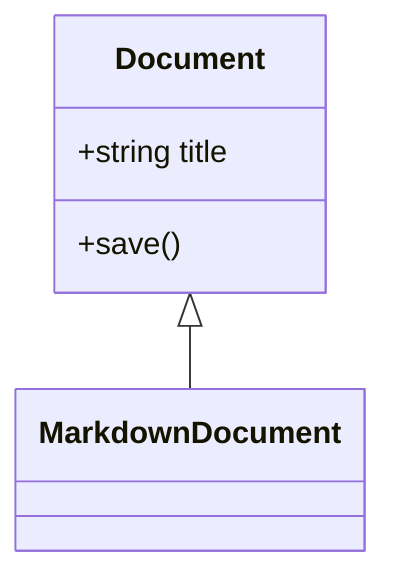

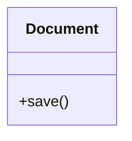

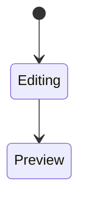

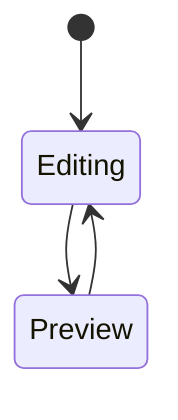

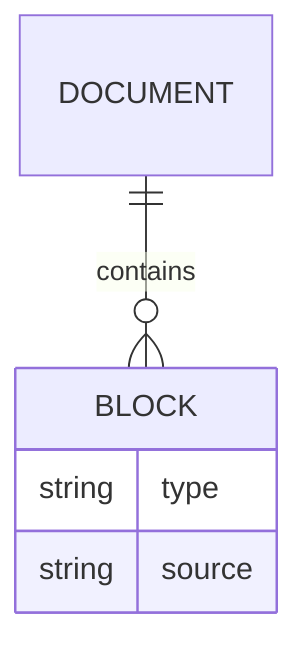

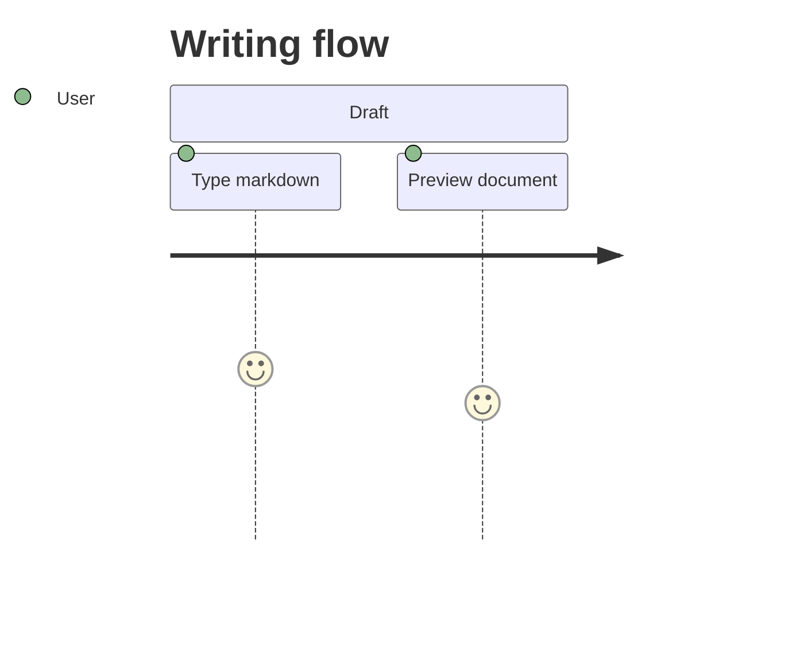

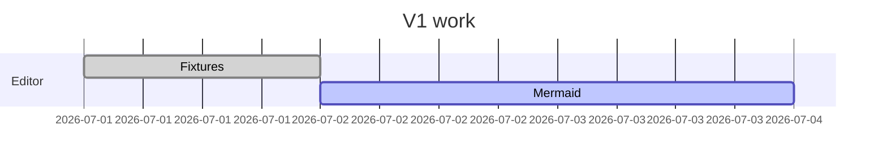

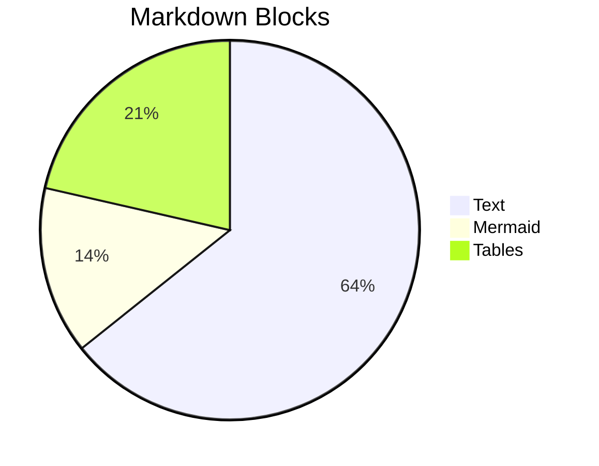

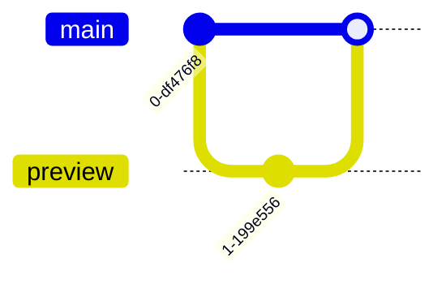

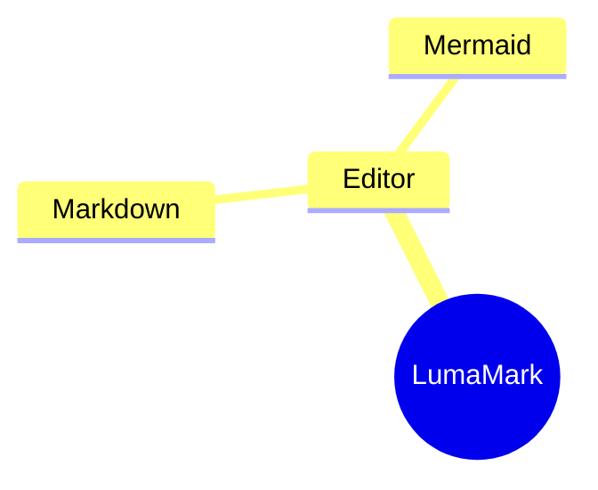

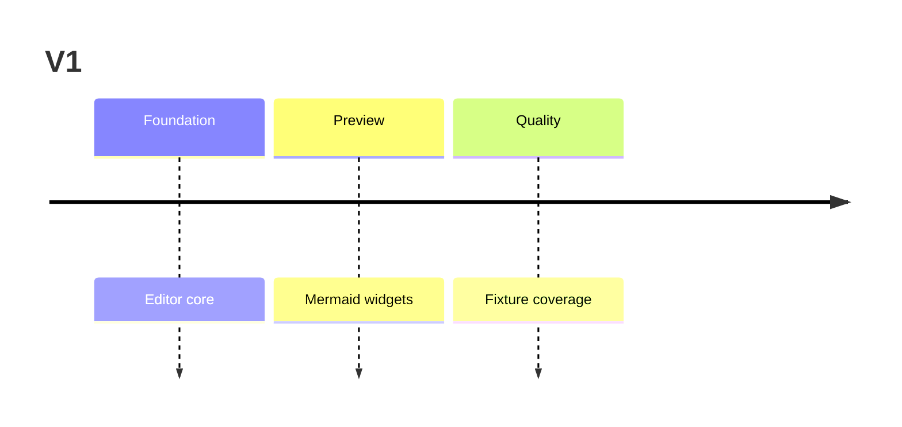

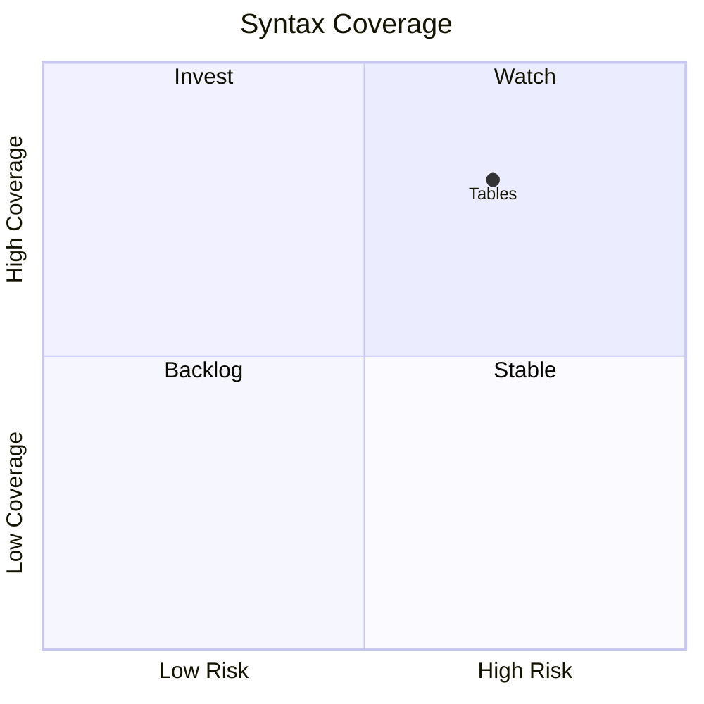

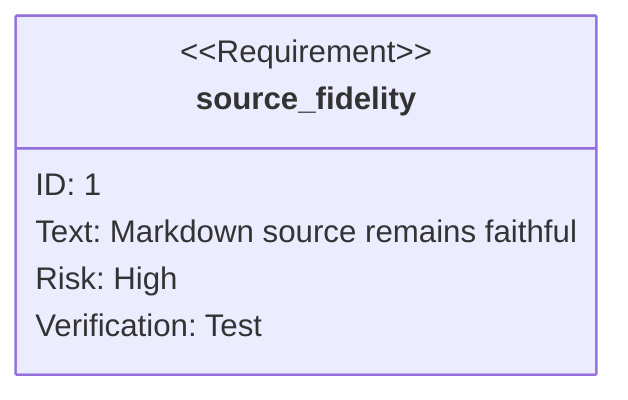

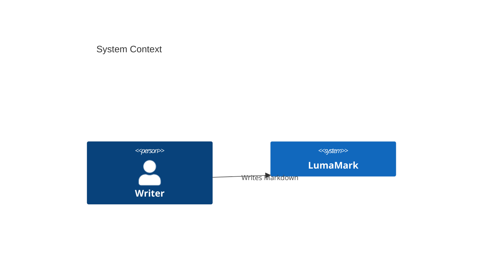

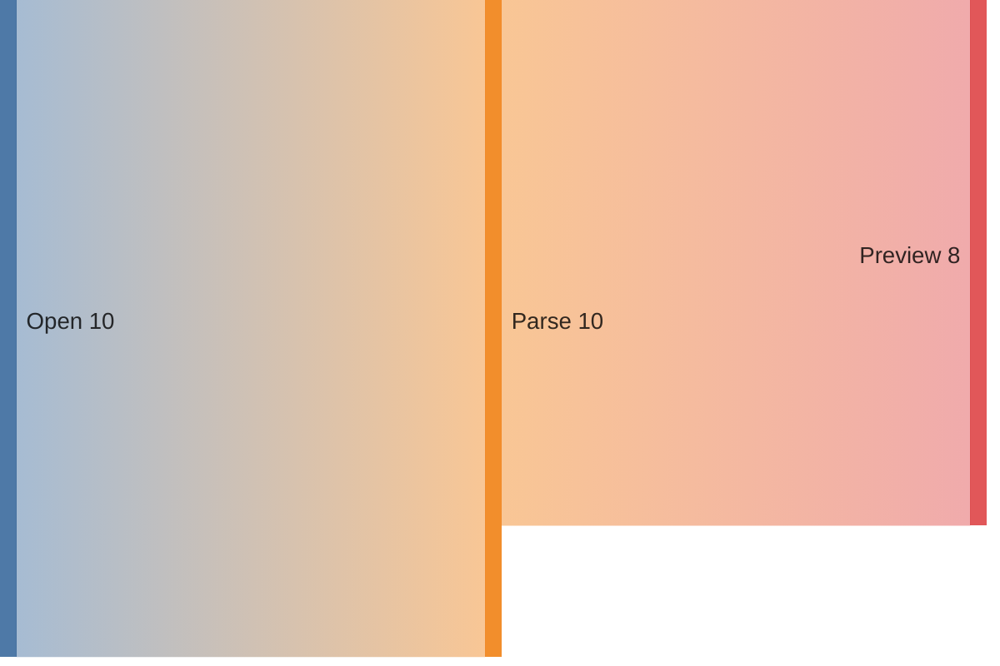

```mermaid
xychart-beta
  title "Fixture Growth"
  x-axis [Jan, Feb, Mar]
  y-axis "Files" 0 --> 10
  line [3, 6, 9]
```

```mermaid
block-beta
  columns 2
  A["Markdown"] B["Preview"]
  A --> B
```

```mermaid
packet-beta
  0-15: "Source Port"
  16-31: "Destination Port"
```

```mermaid
radar-beta
  axis Speed, Quality, Focus
  curve LumaMark{4, 5, 4}
```

```mermaid
architecture-beta
  group app(cloud)[LumaMark]
  service editor(server)[Editor] in app
  service renderer(server)[Renderer] in app
  editor:R --> L:renderer
```

```mermaid
kanban
  todo[Todo]
    docs[Check Mermaid syntax]
  done[Done]
    render[Render preview]
```

```mermaid
treemap-beta
  "Documents"
    "Markdown": 10
    "Mermaid": 4
```

```mermaid
venn-beta
  set A [Markdown]
  set B [Preview]
  union A,B [LumaMark]
```

Gallery text after all diagrams.
