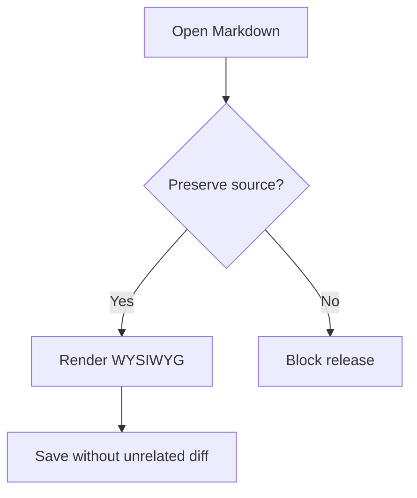
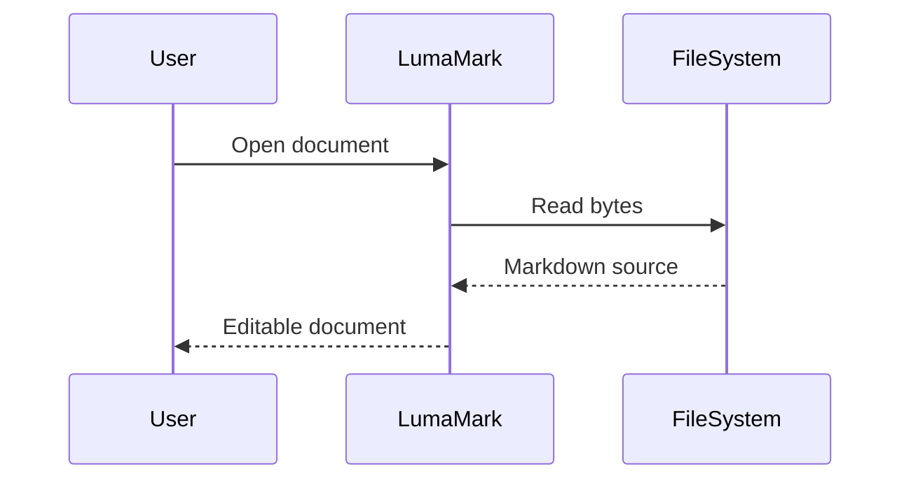

# Mermaid Fixture

```mermaid
flowchart TD
  A[Open Markdown] --> B{Preserve source?}
  B -- Yes --> C[Render WYSIWYG]
  B -- No --> D[Block release]
  C --> E[Save without unrelated diff]
```

```mermaid
sequenceDiagram
  participant User
  participant LumaMark
  participant FileSystem
  User->>LumaMark: Open document
  LumaMark->>FileSystem: Read bytes
  FileSystem-->>LumaMark: Markdown source
  LumaMark-->>User: Editable document
```

Text after Mermaid blocks must remain ordinary Markdown.
